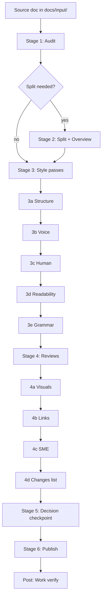

# Architecture — docs-pipeline

## The big picture

We have a bunch of documentation pages that need improving. The problem is that improving a doc involves a lot of steps — and it's easy to do them in the wrong order, skip one, or forget what you've already done.

The docs pipeline solves this. It's a set of Claude Code skills that take a doc from "rough source" to "published and live" by walking through a fixed sequence of stages. Each stage does one thing. They build on each other. You can stop between any two stages and pick up later.

Think of it like a car wash with stations: soap, rinse, wax, dry. You don't skip the rinse because it feels optional — each station exists for a reason and they go in that order.

---

## What a "skill" is

Each stage is a **skill** — a markdown file full of instructions that Claude Code reads and follows. When you type `/docs-diataxis-audit`, Claude loads that skill file and executes the steps inside it. The skill tells Claude what to look at, what to produce, and what to check before moving on.

Skills are just text files. They live in `~/.claude/skills/`. You can read them, edit them, and version them like any other file.

---

## Knowledge sources

Three knowledge files live in `_knowledge/` and are loaded by accuracy-sensitive pipeline stages. Populate these before running the pipeline:

- `_knowledge/glossary.yaml` — domain terminology loaded by `docs-grammar-spelling` to check canonical forms and catch common mistakes
- `_knowledge/product-kb/` — product model files loaded by `docs-sme-review` to fact-check domain accuracy claims
- `_knowledge/style-guides/style-guide.md` — voice and tone rules loaded by `docs-style-check-voice`

Placeholder files with instructions are in `_knowledge/`. The pipeline will run without them, but Stage 3b (voice), Stage 3e (grammar), and Stage 4c (SME review) will produce generic or incomplete results.

---

## The workspace

Before anything runs, the pipeline creates a **workspace** — a folder in `~/projects/` named like `workspace_doc-1319_setup-and-credentials`. This is where everything lives:

```
workspace_doc-1319_setup-and-credentials/
  docs/
    input/          ← source files copied from the live docs repo
    output/
      docs/         ← the finished, improved docs
      _process/     ← audit reports, style notes, review outputs, changes log
  CLAUDE.md         ← instructions for Claude working in this project
  README.md
  _shared/          ← symlink to shared tools and style guides
```

The workspace is a git repo. Every stage commits its output. So you can always see exactly what changed at each step.

---

## The stages

```
┌─────────────────────────────────────────────────────────────────┐
│  Stage 0   Workspace Setup                                      │
│  Stage 1   Diataxis Audit          ← classify the content       │
│  Stage 2   Split (if needed)       ← break mixed docs apart     │
│  ─────────────────────────────────────────────────────────────  │
│  Stage 3   Style Passes                                         │
│            3a  Structure check                                  │
│            3b  Voice check                                      │
│            3c  Human check (de-AI)                              │
│            3d  Readability check                                │
│            3e  Grammar & spelling                               │
│  ─────────────────────────────────────────────────────────────  │
│  Stage 4   Reviews                                              │
│            4a  Visuals review                                   │
│            4b  Links review                                     │
│            4c  SME review                                       │
│            4d  Changes summary                                  │
│  ─────────────────────────────────────────────────────────────  │
│  Stage 5   Decision Checkpoint                                  │
│  Stage 6   Publish                                              │
│  Post      Work Verify                                          │
└─────────────────────────────────────────────────────────────────┘
```

Style passes come before reviews. You clean up the prose first — then you check it for accuracy and cross-links. Doing it the other way around means you'd be reviewing text that still has AI writing patterns in it.

---

## Flow diagram



---

## Stage details

### Stage 0 — Workspace Setup (`/docs-workspace-setup`)

Creates the project directory (`workspace_doc-{num}_{slug}`), runs `git init`, adds shared resource symlinks, writes `CLAUDE.md` and `README.md`, and copies the source doc(s) into `docs/input/`. Optionally creates a project note in your tracking tool.

**Outputs:** Project directory, initial git commit, source docs in place.

---

### Stage 1 — Diataxis Audit (`/docs-diataxis-audit`)

Reads the source doc and classifies every section by [Diataxis type](https://diataxis.fr/):

| Type | What it is |
|------|-----------|
| **Tutorial** | Learning-oriented; takes the reader through a task step by step |
| **How-to** | Task-oriented; solves a specific problem for someone who already knows the basics |
| **Explanation** | Understanding-oriented; explores concepts and background |
| **Reference** | Information-oriented; describes things accurately and completely |

Most docs mix types. The audit surfaces those mixtures and recommends whether to split.

**Outputs:**
- `{guide}_audit-report.md` — full analysis with section-level breakdown
- `{guide}_mapping.json` — machine-readable section map (schema: `_shared/schemas/diataxis-audit-mapping/`)
- SVG visualizations of the content distribution

---

### Stage 2 — Split (`/docs-diataxis-split` + `/docs-diataxis-create-overview`)

Uses the JSON mapping from Stage 1 to extract content into separate typed files in `docs/output/docs/`. Each output file gets Diataxis-appropriate `diataxis_type` frontmatter. An overview doc is always created as the entry point.

**Skipped if:** The audit determined the doc is already a single clean type.

**Outputs:** 2–5 typed docs + `index.md` overview in `docs/output/docs/`.

---

### Stage 3 — Style Passes

Five sequential passes. Each one loads what it needs fresh. Each pass edits docs in place.

**3a — Structure (`/docs-style-check-structure`)**
Checks Diataxis structural rules for each doc's type: required sections, heading format, opening sentence, conclusion. Rules differ per type — a how-to has different required sections than a reference.

**3b — Voice (`/docs-style-check-voice`)**
Reads the style guide from `_knowledge/style-guides/style-guide.md`. Populate this with your team's conventions before running. Applies voice and tone, list formatting, callout usage, table structure, terminology, and addressing conventions (`you`, not `the user`).

**3c — Human (`/docs-style-check-human`)**
Removes AI writing patterns: em dashes, banned filler phrases (`it's worth noting`, `notably`), uniform sentence length, bold-label lists, corporate padding.

**3d — Readability (`/docs-readability-check`)**
Estimates the reading grade level of each doc and finds the sentence patterns that make technical writing feel dense: stacked clauses, too many facts in one sentence, jargon followed by a clause that explains it, and wall paragraphs. Rewrites them toward a target level that depends on the doc type, without changing vocabulary or voice. Never touches tables, code blocks, or callouts. Paragraphs it cannot safely rewrite are flagged for a person. The skill lives in this repo at [`skills/docs-readability-check`](../../skills/docs-readability-check/SKILL.md).

**3e — Grammar & Spelling (`/docs-grammar-spelling`)**
Reads the glossary from `_knowledge/glossary.yaml`. Populate with your domain terminology. Checks spelling, grammar, punctuation, and terminology consistency. Flags anything that needs a human decision rather than silently fixing it.

---

### Stage 4 — Reviews

Read-only passes (except 4d). These produce recommendations, not edits.

**4a — Visuals (`/docs-visuals-review`)**
Reads each doc as the target user and identifies where a diagram, flowchart, or sequence diagram would reduce cognitive load. Mermaid-first; only recommends external images when Mermaid can't do the job.

**4b — Links (`/docs-links-review`)**
Scans the output docs against the full docs corpus. Surfaces content overlaps (deduplication candidates) and missing cross-links (places where we mention something that has its own doc but don't link to it).

**4c — SME Review (`/docs-sme-review`)**
Reads the product knowledge base from `_knowledge/product-kb/`. Populate all KB files before running. Checks domain accuracy, reader journey, naming collisions, and technical clarity against your product model.

**4d — Changes Summary (`/docs-changes-list`)**
Generates `editorial-changes.md`: what the original looked like, what the output docs are, every edit made in Stage 3, visual aid recommendations, cross-link candidates, and SME findings. This is the record that goes into the PR description.

---

### Stage 5 — Decision Checkpoint (`/docs-decision-checkpoint`)

Reads all open recommendations from Stage 4 (flags from style audit, visuals, links, SME). Generates `recommendations.md` and walks through each item interactively: **apply**, **skip**, or **defer**. Nothing goes to publish with unresolved items.

**Why this stage exists:** Style passes are mechanical. Reviews are subjective. The checkpoint is where a human decides which subjective recommendations actually make the cut.

---

### Stage 6 — Publish (`/docs-publish`)

Copies output docs from `docs/output/docs/` into your docs repo, adds docs platform frontmatter (`title`, `slug`, `excerpt`, `hidden`, `createdAt`, `updatedAt` — adjust for your platform), creates `_order.yaml` if needed (platform-specific), archives process artifacts, creates a feature branch, and opens a draft PR.

**Branch naming:** `{YOUR_USERNAME}/doc-{num}-{slug}-v{date}`.

---

### Post — Work Verify (`/docs-work-verify`)

After the PR merges, confirms the changes are live by checking the published URL and comparing key content against what was in the output docs. Surfaces any discrepancies.

### Prompt for your AI model

Paste this into any AI model, together with this document and the files it describes.

```text
I have attached the architecture document for "docs-pipeline". Below is the list of steps I follow today when I improve a document.

[PASTE your current steps, in order, one per line.]

Using only the "Stage details" section, build a table with three columns: my step, the pipeline stage that does the same job (by its number and name), and whether the match is full, partial, or none. After the table, list the pipeline stages I have no step for, and the steps of mine that have no stage. Write "none" unless a stage does the same job as my step. Do not stretch a stage to fit. Do not recommend adding or dropping any stage.

A good answer has one row per step of mine, writes stage names exactly as the document does, and says "none" instead of forcing a match.
```

**How this prompt was checked.** On 2026-10-01 I ran it against Claude Sonnet and Claude Haiku in the same way as the prompts at the end of this document. The first version let Sonnet match steps to stages that do not do the same job. The prompt now says to write "none" and not to stretch a stage to fit, and Sonnet passed on the rerun. Haiku still stretched one step (rewriting by hand) onto the style passes, so treat this prompt as verified on Sonnet only.

---

## Key design decisions

**Why style before reviews?**
Style passes change the text. If you run the SME review first, you're reviewing prose that still has AI patterns and structural problems in it. Clean the text first, then review it for accuracy.

**Why a decision checkpoint before publish?**
The reviews produce recommendations, not mandatory changes. Some suggestions are right for the doc; some aren't. The checkpoint forces an explicit decision on each one rather than letting them fall through the cracks or auto-applying things that shouldn't be applied.

**Why git commits between stages?**
Each stage produces a trackable diff. If something goes wrong — or you want to review exactly what the voice pass changed — it's in git history. This also means you can resume a pipeline mid-stream by checking which commits already exist.

**Why a separate workspace per ticket?**
Multiple docs can be in-flight simultaneously. Separate workspaces mean separate git histories, no branch conflicts, and clear ownership per ticket. The main docs repo stays on the version branch throughout.

---

## Skill file format

Each skill file starts with YAML frontmatter:

```yaml
---
name: docs-diataxis-audit
description: One-line description used to match the skill to user requests
argument-hint: <optional argument format>
allowed-tools: [Read, Write, Edit, Glob, Grep, Bash, Agent]
---
```

Followed by markdown instructions. Claude reads the skill file at invocation time and follows the steps literally. Skills can reference other skill files (e.g., the pipeline skill says "follow the complete `/docs-diataxis-audit` process — read that skill file and execute all steps").

This means updating a skill updates its behavior everywhere it's referenced, including inside the pipeline.

---

### Prompt for your AI model

Paste this into any AI model, together with this document and the files it describes.

**Understand and teach**

```text
I have attached the architecture document for "docs-pipeline". Teach it to me as if I am a technical writer who has never seen it.

1. Explain the big picture in plain language.
2. Walk through the stages in order, one line each.
3. Explain each design decision under "Key design decisions" and the reason the document gives for it.
4. Then ask me three questions to check that I understood, one at a time. Wait for my answer before the next one, and correct me where I am wrong.

A good answer covers every stage and every design decision in the document, gives the document's reasons and not new ones, and does not invent a stage or a decision.
```

**Review against your own setup**

```text
I have attached the architecture document for "docs-pipeline". Below is a description of how my team works on documentation.

[PASTE a short description of how your team handles documentation: tickets, branches, reviewers, and how many docs are in flight at once.]

Go through each decision under "Key design decisions". For each one, say whether it fits my team as described. If it does not, say what I would change and what I would lose by changing it.

A good answer takes the decisions one at a time, ties every judgment to something in my description, and says "my description does not say" when it cannot tell.
```

**Adapt and test**

```text
I have attached the architecture document for "docs-pipeline". I want to confirm that the pipeline behaves the way the document describes, without publishing anything.

Write me a dry-run checklist with these four checks:
1. The stages run in the order the document shows.
2. I can stop between any two stages and pick up later.
3. Each stage's output is committed, so I can see exactly what that stage changed.
4. The decision checkpoint stops anything from being published while a recommendation is unresolved.

For each check give the action to take, the result I should see, and what a failure would look like. Use only claims the document makes. Where the document does not say how to see something, say so.

A good answer has exactly these four checks, does not invent commands or file names, and points out where the document is silent.
```

**How these prompts were checked.** On 2026-10-01 I ran every prompt in this document through the Claude Code command line, once against Claude Sonnet and once against Claude Haiku (the `sonnet` and `haiku` model names in Claude Code 2.1.287). Each run was a fresh session with no tools and no other instructions. I attached this document and any other file the prompt names, replaced each bracketed input with a made-up sample, and read every answer against that prompt's "good answer" list. I have not run them against models from other vendors, so "any AI model" means "should work", not "verified".

| Prompt | Sonnet | Haiku |
| --- | --- | --- |
| Understand and teach | Pass | Pass |
| Review against your own setup | Pass | Pass. It invented an example branch name that was not in the input. |
| Adapt and test | Pass. It listed where the document is silent, for example what the commit messages look like. | Pass |

