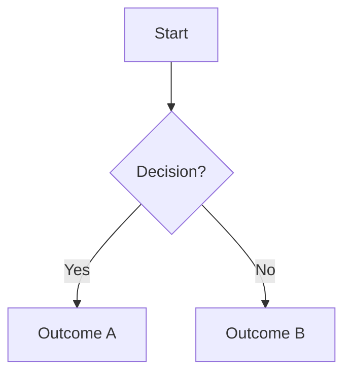
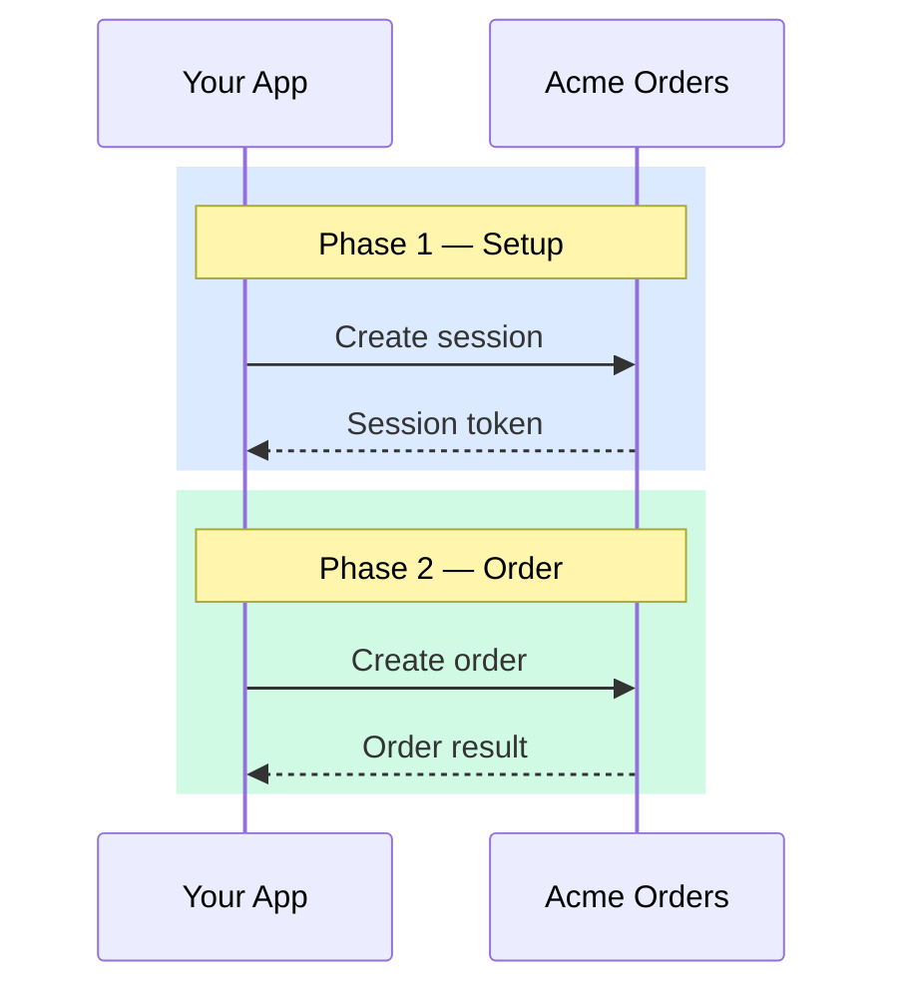
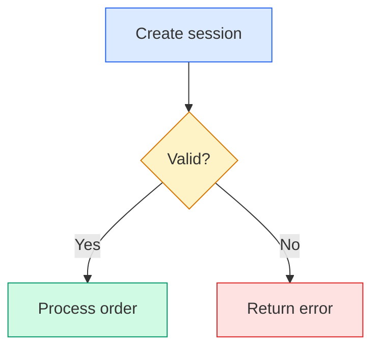

# Diagram Style Guide

Rules for when and how to use diagrams in Acme Orders documentation. Mermaid is the default rendering engine. All diagrams are written inline in markdown code blocks.

## When to use a diagram

A diagram earns its place when it communicates something that prose alone struggles to make clear. Use these thresholds:

**Strong candidates (use a diagram):**
- Three or more parties exchanging messages across steps, especially with async handoffs, redirects, or timing constraints
- Branching decisions where a wrong path has real consequences (wrong API call, fulfillment error, rejected order)
- A process with named states that transition based on conditions or events
- Timing constraints or ordering dependencies that are easy to miss in prose

**Skip the diagram:**
- Fewer than three steps or two decision points
- Reference or lookup content (tables are better)
- Content already served by an existing diagram nearby
- Short linking or introductory paragraphs
- Linear sequences with no branching (a numbered list works)

## Choosing the right type

| Content pattern | Mermaid type | When to use |
|---|---|---|
| Multiple parties exchanging messages | `sequenceDiagram` | API call flows, order creation sequences, webhook delivery chains |
| Branching decisions with outcomes | `flowchart TD` | Decision trees, validation flows, error handling paths |
| Named states with transitions | `stateDiagram-v2` | Invoice lifecycles, order status flows, onboarding stages |
| Math, allocation, or comparison | Annotated table (not Mermaid) | Proration calculations, discount allocation, feature comparison |

When in doubt between a flowchart and a sequence diagram: if the emphasis is on who does what, use a sequence diagram. If the emphasis is on what happens next, use a flowchart.

## Mermaid conventions

### Flowcharts

Always use top-down direction (`TD`). Left-to-right reads poorly on narrow viewports.



Node shapes:
- `[text]` — rectangle (actions, steps)
- `{text}` — diamond (decisions)
- `([text])` — stadium/rounded (start/end points)

Edge labels: keep short (one to three words). Put longer context in a `Note` or in the prose before the diagram.

### Sequence diagrams

Use `rect` blocks with `rgb()` background colors to separate logical phases. This makes multi-step flows scannable.



Participant aliases: use short, readable names. `App as Your App` not `App as YourApplicationServer`.

Failure notation: use `--x` (dashed with X) for explicit connection breaks or failures. Add a `Note` explaining what failed and why.

Timing constraints: use `Note over` to call out expiration windows, validity periods, or ordering dependencies (e.g., "Session token valid until expires_at").

### State diagrams

State names follow domain language from the API (e.g., `Submitted`, `VerificationFailed`, `Live`). Don't invent names; use the actual status values customers see.

```mermaid
stateDiagram-v2
    [*] --> Processing
    Processing --> Succeeded
    Processing --> Failed
    Processing --> Canceled
    Failed --> Processing : retry

    note right of Succeeded : Terminal state
    note right of Canceled : Terminal state
    note right of Failed : Non-terminal; retries possible
```



Annotations: use `note right of` to mark terminal states, retry behavior, or the event name that triggers the transition.

## Color palette

Use these semantic color classes consistently within a guide set. Not every diagram needs all colors; pick the ones that apply.

| Meaning | Fill | Stroke | CSS class name |
|---|---|---|---|
| Setup / configuration | `#dbeafe` | `#2563eb` | setup |
| Session / context | `#e0e7ff` | `#4f46e5` | session |
| Order / success | `#d1fae5` | `#059669` | order |
| Decision / branch | `#fef3c7` | `#d97706` | decision |
| Neutral / delivery | `#f3f4f6` | `#6b7280` | delivery |
| Warning / error | `#fee2e2` | `#dc2626` | warning |

Apply with `classDef` and `class` in flowcharts:



For sequence diagrams, use the `rgb()` equivalents in `rect` blocks.

Extending for new domains: if a guide needs a color not in this palette, pick from Tailwind's 200-weight fills and 600-weight strokes. Add it to the table above when it becomes reusable.

## Context around the diagram

Every diagram needs prose around it. A diagram without context is a puzzle.

### Before the diagram

One to two sentences explaining what the reader is about to see and why it matters. Frame it as "here's the thing you need to understand" not "the following diagram shows."

```markdown
The order creation flow involves three parties. Your app creates a session,
the customer confirms the order in the browser, and Acme Orders validates the
order with the invoicing service.
```

### Title

Use an H3 heading when the diagram represents a distinct concept the reader might search for or link to. Skip the heading when the diagram is inline support for a paragraph (e.g., a small decision tree inside a step).

### After the diagram

Call out the key takeaway. What should the reader notice? Where does the flow diverge from what they might expect? This is where you add the "watch out" or "this is why step 3 matters" context.

## Complexity limits

If a Mermaid diagram has more than 12-15 nodes or more than 4 swimlane participants, split it. Options:

- Break into sequential diagrams by phase (use `rect` phases as the split boundary)
- Extract a sub-flow into its own diagram with a cross-reference
- Simplify by collapsing detail nodes into a single labeled step, with prose covering the detail

A diagram that requires horizontal scrolling on a standard viewport has failed.

## Annotated tables (non-Mermaid)

For math, proration, or allocation scenarios, use a worked-example table with column headers for each category and rows for each line item. Include a totals row. Add a brief annotation below explaining the formula or logic.

```markdown
| Item | Discount eligible | Amount | Discount applied | Customer pays |
|---|---|---|---|---|
| Notebook | Yes | $4.50 | $0.50 | $4.00 |
| Pen set | No | $3.99 | $0.00 | $3.99 |
| **Total** | | **$8.49** | **$0.50** | **$7.99** |

Discounts apply to eligible items first. The remaining balance is added to the
customer's invoice.
```

## Process artifacts

During the Diataxis split workflow, diagrams are created and stored as process artifacts:

```text
_extras/process/{slug}_{TICKET_ID}/
└── visual-audit/
    ├── visual-audit-output.md       (recommendations report)
    └── diagrams/
        ├── {descriptive-name}.md    (one diagram per file)
        └── ...
```

Each diagram artifact file contains:
- A title (H1 or H2)
- "Used in" reference (target filename and section heading)
- The Mermaid code block
- Any notes about implementation choices

At publish time, diagrams are copied from the artifact files into the target docs inline. The artifact files remain in `_extras/process/` for reference.

## Quality checklist

- [ ] Diagram type matches the content pattern (see choosing table)
- [ ] Prose before the diagram sets up what the reader will see
- [ ] Prose after the diagram highlights the key takeaway
- [ ] Node count stays under 15; split if larger
- [ ] Color classes use the standard palette (or a documented extension)
- [ ] No horizontal scrolling on standard viewport
- [ ] State names and participant names match the domain language customers see
- [ ] Failure points are explicitly marked (not just implied)
- [ ] Timing constraints are called out with `Note over` or `Note right of`
