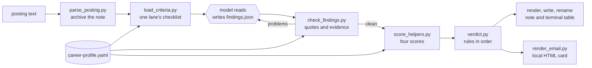

# Job assessment: architecture

This document explains how the job assessment system is put together: what goes in, what the model does, what the code does, and every rule that turns a reading of a posting into a verdict. It is written for someone who wants to check the rules, change them, or build something like this for a different kind of decision.

The rules here are a snapshot dated 2026-10-01. They were rebuilt from the author's private version of this tool, which keeps changing. Where the private version's wording left room for two readings, the choice made here is listed under [Interpretations](#interpretations).

## The one design decision

**The model reads. The code checks, counts and decides.**

A language model is good at reading a job posting and saying which sentence touches which of your criteria. It is not reliable at doing the same arithmetic the same way twice, and it will happily fill a silence with a guess. So the work is split:

| Part of the job | Done by | Why |
|---|---|---|
| Reading the posting, rating each criterion, quoting the words behind each rating | the model | This needs judgment about language. |
| Checking every quote is really in the posting, and every claimed qualification points at real evidence | `assessment/scripts/check_findings.py` | A model can misquote or overclaim. Code can look it up. |
| Turning ratings into four scores | `assessment/scripts/score_helpers.py` | Arithmetic should give the same answer every time. |
| Turning scores into a verdict | `assessment/scripts/verdict.py` | The rules are fixed and checked in order. The company's name is not an input. |

The model hands its reading over as a **findings file**: JSON, one rating per criterion, each tied to a quoted phrase. The findings file is the only thing the model produces that counts. A score or verdict typed by a model is ignored.

This split does not make the model's reading correct. It makes it visible and small. In a recorded live run (`tests/e2e-output-run1.md`), the model read one fictional posting's line "You can document our mobile SDK" as optional, where the expected answer counts it as a skill gap. Every quote it gave was real, so the checks passed, and the scripts turned that one different reading into a different verdict. The disagreement sits in one field of one file, where a person can see it and fix it. The other three scores matched the expected answer.

## How one posting flows through the system



| Step | Script | What it does | Stops when |
|---|---|---|---|
| 0 | `scripts/validate_profile.py` | Checks the central file. | The file breaks a rule (exit 1). |
| 1 | `assessment/scripts/parse_posting.py` | Saves the posting as a note with its state fields, and splits likely-real requirement lines from likely-filter lines. | The same company, role and lane is already archived (exit 4). A second lane is not a duplicate. |
| 2 | `assessment/scripts/load_criteria.py` | Prints the hard blocks and the one lane's checklist. | The lane is unknown (exit 2) or disagrees with the note (exit 3). |
| 3 | the model, following `assessment/SKILL.md` | Reads the posting and writes `findings.json`. `match_skills.py` helps by listing every skill the posting mentions, with the sentence it came from. | |
| 4 | `assessment/scripts/check_findings.py` | Checks the findings against the posting and the profile. | Any problem (exit 1). The model fixes its findings and runs it again. |
| 5 | `assessment/scripts/score_helpers.py` | Computes Fit, Comp, Qualifications and Culture. | A rating points at an id the profile does not have. |
| 6 | `assessment/scripts/verdict.py` | Applies the verdict rules. | |
| 7 | `render_assessment.py`, `write_assessment.py`, `rename_verdict.py` | Writes the assessment block into the note, sets its state, and puts the verdict, source and lane emoji at the front of the file name. | |
| 8 | `render_assessment.py --terminal` | Prints the summary table with its legend. | |
| 9 | `render_email.py`, `check_email.py` | Writes the summary card to a local HTML file and checks its shape. Nothing is ever sent. | The card is missing its job link, scores or checks (exit 2). |

`scripts/assess_offline.py` runs steps 0 to 9 in that order from a saved findings file, with no model and no network. It is how the tests and the quickstart prove the chain works.

## The central file

Everything about the person lives in one file, `career-profile.yaml`. Its contract is `schema/career-profile.schema.json`. The intake interview (`intake/`) builds it one confirmed answer at a time, and every write goes through `scripts/add_entry.py`, which checks the entry before saving it.

| Section | Holds | Used by |
|---|---|---|
| `person` | display name, target roles, years of experience, a location label for picking a pay tier, and a working style (gather knowledge from experts, or become the expert) | Qualifications, Comp |
| `sources` | where postings come from, each with an emoji | file names |
| `hard_blocks`, `named_exceptions` | kinds of employer the person will never work for, and one-off exceptions | the first verdict rule |
| `comp` | five pay numbers: floor, min, open ask, target, stretch ceiling | Comp |
| `culture` | perks marked big or nice, the time-off threshold, hustle phrases, and phrases that cost nothing | Culture |
| `soft_flags`, `benefits_and_terms`, `company_criteria` | smaller worries, terms that matter, and companies of interest | Culture, and a company read that never changes the verdict |
| `lanes` | each kind of role the person is looking at, with its own must-haves (strong or soft), autonomy signals, keyword signals and known gaps | Fit, Qualifications |
| `employers`, `evidence` | job history, and accomplishments with who did the work (`authorship`), whether a document backs them (`proof`) and where the fact came from (`source`) | Qualifications |
| `skills` | a 0 to 5 self-score per skill, whether the person wants more of it, when they last used it, and which evidence entries show it | Qualifications, Fit |
| `meta` | which intake stages are done, and the person's closing words | the intake |

**Why every claim needs a source.** An assessment is only as honest as the file behind it. A self-score is the person's own claim, never evidence. A qualification counts only when a finding cites an evidence id, and the code refuses an id that does not exist, that is marked `do_not_use`, or whose `authorship` is `OTHER-AUTHOR` (work someone else did). Evidence from an interview or a reference stays `proof: unchecked`, because nothing was read to back it.

## What the validator checks

`scripts/validate_profile.py PROFILE [--fixture] [--json]` exits 0 when the file is clean, 1 when it finds problems, and 2 when it cannot run. Each problem is one line that starts with its YAML path.

**Errors (exit 1):**

1. The file breaks the schema: a wrong type, a value outside an allowed list, a missing required field, or an unknown field.
2. A cross-reference does not resolve: a skill points at a missing evidence id, evidence at a missing employer, a known gap at a missing skill, a writing sample at missing evidence, or a named exception at a missing hard block.
3. Two entries in one section share an id, or two lanes share a name.
4. Pay numbers that are present are out of order. They must run floor, min, open ask, target, stretch ceiling, from low to high.
5. Evidence from an interview or a reference is marked `proof: checked`.
6. A field holds something shaped like an email address or a phone number. The schema has no contact fields at all.
7. A skill scored 4 or 5 says it was never used.
8. With `--fixture` only: the first line is not the FICTIONAL banner, or a link is not on `example.com`, `example.org` or `example.net`.

**Warnings (printed, exit stays 0):** a skill scored 3 or higher with no evidence, evidence with no dates, a strong must-have with no reason, an empty perks list, and a lane with no must-haves of its own.

**What it cannot see.** The validator checks shape and consistency, not truth. A file can pass every check and still overstate what the person can show, or say less than the person means. Those are judgment gaps. The "find gaps" prompt in `intake/README.md` asks a model to look for them, and `fixtures/gappy-profile.yaml` passes the validator with some planted for testing.

## The findings file and the checks on it

The model's output contract is `schema/findings.schema.json`. `assessment/SKILL.md` step 4 shows a full example. The parts that matter most:

- Every requirement in the lane should get a rating on one five-level scale (one the findings leave out is scored as unknown, see Interpretation 4): **strong, fair, weak, poor, unknown**. The must-have's severity (strong or soft) never changes the rating. It only changes what the rating costs.
- Every rating other than unknown carries a quote copied from the posting.
- A qualification is written as `{requirement_quote, evidence_ids}`. There is no free-text field for a strength. A skill the posting wants that the person scored highly but cannot show is written as `{skill_id, status: unproven}`.
- `verdict_reason` is one or two plain sentences for a person, written before the verdict is known.

`check_findings.py FINDINGS --posting P --profile PROFILE` exits 1 when:

1. A rating other than unknown has no quote, or its quote is not in the posting text. Case, spaces, curly quotes and dashes are ignored. Words are not.
2. A read that autonomy is poor rests only on generic phrases ("partner with", "work closely", "collaborate", "stakeholder" and similar). Those appear in almost every senior posting. If that is all the posting says, the honest rating is unknown.
3. A perk, a hustle phrase, a low time-off note, a soft flag or a negative phrase has no quote found in the posting.
4. An evidence id does not exist, is marked `do_not_use`, or belongs to someone else's work.
5. A requirement, perk, hard block, named exception or skill id is not in the profile.
6. The findings' lane, the posting's lane and the profile's lanes disagree.
7. `verdict_reason` is missing or uses rubric words such as "4c" or "job-type override".

## Scoring rules

Each score runs from 0 to 10. All four are computed by `assessment/scripts/score_helpers.py` from the findings file and the profile.

| Score | Rule |
|---|---|
| **Fit**: does the job's shape match what you want? | Start at 10. For each **strong** must-have in the lane: strong or fair costs 0, weak costs 1.5, poor costs 3, unknown costs 1.5. For each **soft** must-have: weak or poor costs 1, anything else costs 0. Must-haves marked `bonus` never cost anything. Autonomy the findings mark `net: negative` (the model's overall read: positive, neutral, negative or unknown) costs 2. Each skill the person would rather avoid that is core daily work in this job costs 1, at most 2 in total. Floor 0. |
| **Comp**: is the base pay enough? | Base pay only, never bonus or equity. Pay not listed scores **5**, a neutral middle, not 0. When pay is listed, pick the tier (the person's named location, else a nationwide or "everywhere else" tier, else the lowest tier) and score the **top** of its range: at or above target 10; at or above min 8; at or above floor 3; below floor 1. |
| **Qualifications**: can you do this job, going by your evidence? | Start at 10. Asking for more years than the person has, or for years in a narrow sub-domain, costs 2 (once). Each load-bearing known gap costs 1, and self-scores of 0 or 1 on load-bearing lines share the same cap of 4 (one skill is never counted twice). A working-style mismatch costs 3. Floor 0. |
| **Culture**: what does the posting say about how people are treated? | Start at **5**, because silence tells you nothing. A big perk adds 2, a nice perk adds 1, a strong positive phrase adds 1. Low time off (below the person's threshold, or accrual only) costs 2. Each hustle phrase costs 1, at most 3. Each tripped soft flag costs 1, but unlisted pay is never a Culture cost because Comp already scored it. Each negative phrase costs 1. Floor 0, cap 10. |

**Rounding.** Each score is clamped to its floor and cap and then rounded half up to a whole number (8.5 becomes 9, not 8) before the verdict rules run.

### Prompt for your AI model

Use this to check the arithmetic above by hand against the three fictional postings.

<!-- prompt: prompts/04-test-scoring.txt -->
```text
I'm attaching ARCHITECTURE.md, fixtures/robin-sample/career-profile.yaml, the three postings in fixtures/postings/ and their files in fixtures/findings/. For each posting, apply the scoring rules by hand to its findings file. Show the arithmetic for Fit, Comp, Qualifications and Culture, round each the way ARCHITECTURE.md says, then apply the verdict rules in order and name the rule that decided it. Only after all three answers are written, open fixtures/expected.yaml, compare, and list every mismatch with the step where your arithmetic and the file disagree. A good answer matches all three verdicts and all twelve scores.
```

## Verdict rules

`assessment/scripts/verdict.py` checks these in order. The first rule that fires decides, and nothing after it is looked at.

| Order | Rule | Fires when | Verdict |
|---|---|---|---|
| 1 | Hard block | The posting trips one of the person's hard blocks, and no named exception covers this company. The findings record whether an exception applies; `verdict.py` only learns whether a block is still tripped. | Skip |
| 2 | Job-type override (4a) | A required skill that is central to the daily work has no evidence behind it at all. It is a different job with a familiar title. Subject knowledge, such as finance or law, counts as a skill here. | Skip |
| 3 | Score floor (4b) | Fit is 5 or lower, or Qualifications is 5 or lower. | Skip |
| 4 | Reservations band (4c) | Comp is 3 or lower, or Culture is 3 or lower, or the average of Fit and Qualifications is under 7. | Apply with reservations |
| 5 | Apply (4d) | Nothing above fired. | Apply |

**Trigger labels.** `verdict.py` reports which rule fired as `hard block`, `4a`, `4b`, `4c comp`, `4c culture`, `4c comp and culture`, `4c average` or `4d`. `fixtures/expected.yaml` writes the same labels with a hyphen, for example `4c-average`.

**The company read is never an input.** The profile can name companies the person is excited about, and the assessment shows that read, but `verdict.py` takes four numbers and two optional flags and nothing else. A test checks its signature.

## Worked example: posting 03

`fixtures/postings/03-unlisted-pay-perks.md` is a fictional senior writer role, read against Robin Sample's `tech-writing` lane. Its findings file is `fixtures/findings/03-unlisted-pay-perks.findings.json`.

| Score | Arithmetic | Result |
|---|---|---|
| Fit | 10. Expert access is a strong must-have rated weak: minus 1.5. A say in the tools is a strong must-have the posting never mentions, so unknown: minus 1.5. The style guide is soft and rated fair: 0. Autonomy is unknown, because the posting only uses generic collaboration words: 0. 10 - 1.5 - 1.5 = 7. | 7 |
| Comp | Pay is not listed. | 5 |
| Qualifications | 10. The posting asks for 11 years and Robin has 9: minus 2. Mobile SDK docs is a known gap: minus 1. Kubernetes is a self-score gap on a required line: minus 1. 10 - 2 - 1 - 1 = 6. | 6 |
| Culture | 5. Extra paid days off is a big perk: plus 2. A learning budget is a big perk: plus 2. "Fast-paced" is on Robin's list of phrases that cost nothing. 5 + 2 + 2 = 9. | 9 |

Verdict: no hard block, no override, Fit and Qualifications are both above 5, Comp and Culture are both above 3, but the average of Fit and Qualifications is (7 + 6) / 2 = 6.5, under 7. **Apply with reservations**, rule 4c.

## Interpretations

The private rules this was rebuilt from are written as prose. These are the places where that prose left room for two readings, and the choice the code makes. Items 1 to 13 are pinned by tests in `tests/test_score_helpers.py` and `tests/test_check_findings.py`. Item 14 is display only.

1. **A fair rating on a soft must-have costs nothing.** Only weak and poor cost 1.
2. **A pay top between the open ask and the target scores 8.** The open ask is stored but is not a scoring boundary.
3. **Each score is rounded half up before the verdict rules run**, so an average of 6.5 is computed from whole numbers.
4. **A strong must-have the findings never mention counts as unknown and costs 1.5.** A silent soft must-have costs nothing. Other silent items, such as perks, cost nothing.
5. **Too many years and a narrow sub-domain cost 2 once in total**, not 2 each.
6. **Known gaps and self-score gaps are one set.** A known gap that names a `skill_id` and a self-score gap on the same skill count once, under the shared cap of 4.
7. **The code picks the pay tier, not the model.** A tier whose label contains the person's location label wins, then a tier whose label says nationwide, national, everywhere else, all other or similar, then the tier with the lowest top. The model's `tier_used` is ignored.
8. **Low time off.** Accrual-only time off counts as low. A stated number of days counts as low when it is under the person's threshold. With neither, the model's flag stands.
9. **Hustle phrases.** A phrase on the person's `free_phrases` list costs nothing. Any other hustle phrase the model quotes costs 1, even if it is not on the person's `hustle_phrases` list.
10. **Unlisted pay is never a soft-flag cost.** Soft flags with ids such as `no_pay_transparency` or `unlisted_pay` are skipped in Culture.
11. **What counts as a generic autonomy phrase.** A quote is generic only when it holds a generic phrase ("partner with", "work closely", "stakeholder" and similar) and none of the phrases that really say who decides ("approval", "sign-off", "reports to", "ownership" and similar). Both lists are in `check_findings.py`.
12. **Quotes must come from the posting text itself.** In a saved note, only the text below the "Full posting text" heading counts, so a quote cannot be satisfied by the assessment block or the note's front matter.
13. **Repeats count once.** The same perk, phrase or soft flag quoted twice adds or costs once.
14. **The email card's autonomy row** shows net positive as strong, neutral as fair and negative as poor. This is display only and changes no score.

**Three phrases stay judgment calls on purpose.** Whether a line is *load-bearing*, whether a skill is *core daily work*, and whether a required skill is *central to the daily work* are decided by the model while it reads, following the definitions in `assessment/SKILL.md` step 3e. The code cannot decide them, and they are where two careful readers are most likely to differ. The live run in `tests/e2e-output-run1.md` differed on exactly this kind of call.

## What this does not do

- It does not predict whether you will be hired, and it has not been compared with any other way of choosing jobs.
- It does not check whether the model's reading of tone is right. The checks catch quotes that do not exist and evidence that does not exist. They cannot catch a real quote read the wrong way, as the live run in `tests/e2e-output-run1.md` shows.
- It does not fetch anything about the company from outside the posting.
- It does not send email. The card is written to a local file.
- It is not machine learning and not a retrieval system. It is prompts, a schema, and ordinary scripts with tests.

---

### Prompt for your AI model

Paste one of these into any AI model, together with this document and the files each one names.

**Understand and teach**

<!-- prompt: prompts/01-understand-and-teach.txt -->
```text
I'm attaching README.md, ARCHITECTURE.md and fixtures/robin-sample/career-profile.yaml from a job assessment tool. Teach me how it works as if I have never seen it. Cover, in this order: what the career-profile file holds and why every claim in it needs a source; how one job posting becomes four scores called Fit, Comp, Qualifications and Culture; the exact order the verdict rules are checked in; and what the tool refuses to do. Use plain words and short sentences. Then ask me three quiz questions, one at a time, and wait for my answer before asking the next. A good answer gives the rule order as hard block, job-type override, Fit and Qualifications floor, reservations band, then Apply, and says unlisted pay scores a neutral 5.
```

**Test the scoring with the fixture**

<!-- prompt: prompts/04-test-scoring.txt -->
```text
I'm attaching ARCHITECTURE.md, fixtures/robin-sample/career-profile.yaml, the three postings in fixtures/postings/ and their files in fixtures/findings/. For each posting, apply the scoring rules by hand to its findings file. Show the arithmetic for Fit, Comp, Qualifications and Culture, round each the way ARCHITECTURE.md says, then apply the verdict rules in order and name the rule that decided it. Only after all three answers are written, open fixtures/expected.yaml, compare, and list every mismatch with the step where your arithmetic and the file disagree. A good answer matches all three verdicts and all twelve scores.
```

**Fix errors**

<!-- prompt: prompts/06-fix-errors.txt -->
```text
I'm attaching the output of a failed command from this tool (the validator, the tests, check_findings.py or assess_offline.py) and the file it names. For each problem in the output, explain the cause in one or two plain sentences, name the YAML path or file the output points to (do not guess line numbers), and propose the smallest change that fixes it, shown as before and after. Change nothing else. Never invent a value I did not give you: where the right value is my call, such as a date, a number or which entry to keep, say so, offer the choices, and write the after with a placeholder such as <your value> instead of a guess. Suggest only values the file or the output shows are allowed; if the allowed values are not shown, say they are listed in schema/career-profile.schema.json instead of guessing. If the output is not enough to know the cause, name the single command I should run next. A good answer on the validator output for fixtures/broken-profile.yaml covers all five problems and names the missing evidence id that one skill points to.
```

**Review the rules for gaps**

<!-- prompt: prompts/r1-review-rules.txt -->
```text
I'm attaching ARCHITECTURE.md from a job assessment tool. Read its scoring and verdict rules. List every place where two careful readers could score the same posting differently, quote the rule, and propose one sentence that removes the ambiguity. Each sentence only clarifies: it keeps every number, band, cap and rule order exactly as the Scoring rules and Verdict rules tables state them, so check each sentence against those tables before you write it. If you think a rule itself is wrong, say so in a separate list instead of changing it. A good answer covers every item listed under Interpretations and does not invent new rules.
```

**Tested on:** Claude Sonnet and Claude Haiku through the Claude Code command line, 2026-10-01. Sonnet passed all 4 prompts here. Haiku passed 3 and partly passed "Fix errors" (it still suggests values the file does not allow). Every run, every rewrite and every grade is in `tests/prompt-runs/GRADES.md`.
